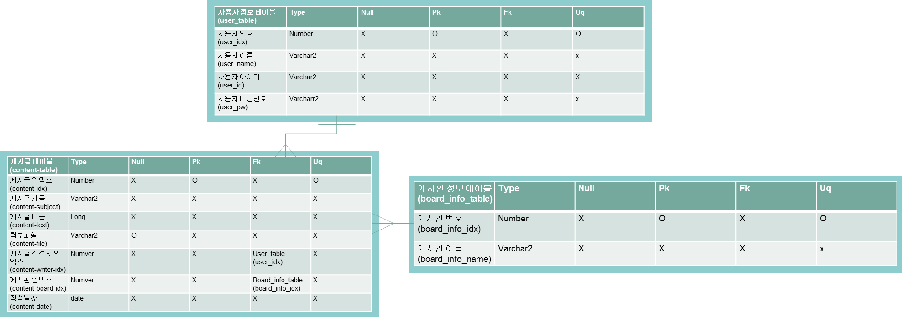
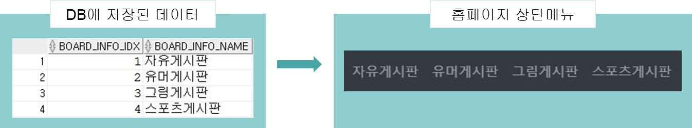

# 프로젝트 설명

본 프로젝트는 게시물을 올리고 내리며 게시글을 다양한 사용자들이 공유할 수 있는 게시판입니다.

### 개발 인원

1명

### 담당 업무

오라클 DBMS 연동을 통한 로그인, 회원가입, CRUD 처리, 페이징 처리

### 프로젝트 목표

사용자들이 실시간으로 다양한 정보를 공유할 수 있는 게시판 홈페이지 제작

### 구현 기능

     - 회원가입
     - 로그인
     - CRUD
     - 페이징 
 

# 개발
### 데이터 베이스 테이블 설계

 

### 상단 메뉴 구성하기

* 상단 메뉴는 유지보수의 효율성을 위해 DB에서 데이터를 가져와 구성하는 방식을 사용하였습니다.
* 상단 메뉴는 모든 요청에 대해 처리해야 하는 부분이기 때문에 interceptor에서 처리합니다.

 

### 유효성 검사 처리하기

* 회원가입 화면에서 입력값에 대한 유효성 검사를 시행합니다.
* 기본 제공되는 유효성 검사 어노테이션을 활용합니다.
* 추가적인 유효성 검사(비밀번호 확인절차)는 Validator를 활용합니다.

